# Case Técnico - Analytics Engineer @ Dadosfera

**Candidato:** Lucas Carvalho Soares da Silva.

**Data:** Janeiro de 2026.

**Dataset:** Brazilian E-Commerce Public Dataset (Olist).

**link:** https://www.kaggle.com/datasets/olistbr/brazilian-ecommerce

# 📂 Estrutura do Repositório

    • /notebooks: Contém o código de tratamento e GenAI.
    
    • /img: prints.
    
    • README.md: Documentação principal.

# 🛠️ Stack Utilizada:

    Data Platform: Dadosfera (Coleta, Explorar, Analisar)

    Linguagens: Python(Processamento e Tratamento via Pandas, e Quality via Pandera), SQL(Modelagem Star Schema)

    IA: LLM para enriquecimento de dados(GenAI via API do Gemini)

    Visualização: Metabase & Streamlit

# 📖 Dicionário de Dados (Principais Entidades e Atributos de Valor)

Foco na documentação das colunas que trazem inteligência analítica para o case:

| Coluna | Tipo | Descrição |
| :--- | :--- | :--- |
| `order_id` | PK (String) | Identificador único do pedido. |
| `order_purchase_timestamp` | Datetime | Data e hora em que a compra foi realizada. |
| `order_hour` | String | Feature Engineering: Horário formatado (HH:mm) para análise de pico. |
| `delivery_diff_days` | Integer | Feature Engineering: Dias de diferença entre entrega real e estimada. |
| `lead_time_days` | Integer | Feature Engineering: Quantidade de dias para a realização da entrega. |
| `genai_category` | String | Inteligência Artificial: Categoria refinada via LLM (Gemini/OpenAI). |

# 📑 Sumário Executivo

Este projeto visa a implementação de uma plataforma de dados ponta a ponta utilizando a Dadosfera.

O foco é transformar dados brutos de e-commerce em ativos de inteligência de negócio, utilizando modelagem dimensional e enriquecimento via Inteligência Artificial(GenAI), entregando análises descritivas e prescritivas com agilidade e menor custo em todas as áreas da empresa.

# ⚠️ Nota sobre a Metodologia de Execução

**Observação Técnica:** Para garantir a máxima integridade e eficiência no carregamento de dados, optei por realizar os itens 4 (Data Quality) e 5 (Enriquecimento GenAI) previamente à etapa de 2 (Integração).

**Motivação:** Tratar os dados em Python e enriquecê-los com LLM antes da ingestão permite que o Data Lakehouse receba arquivos otimizados em .parquet, reduzindo custos de armazenamento, evitando processamento de dados nulos e garantindo que o Catálogo de Dados (Item 3) já nasça com as features de inteligência artificial integradas.

**Narrativa de Negócio:** O projeto simula a fase pós-kickoff de uma implementação real para uma grande empresa de e-commerce.

# 📋 Itens do Case

## **0. Planejamento e Metodologia Ágil**

Organização do projeto utilizando Kanban para gestão de tarefas e prazos.

**Link:** https://trello.com/invite/b/69764932449c1987ea2c18b9/ATTI3248d59ac8be331a71a0f6fa3e88fcf36E8F88A2/planejamento-case-tecnico-dadosfera

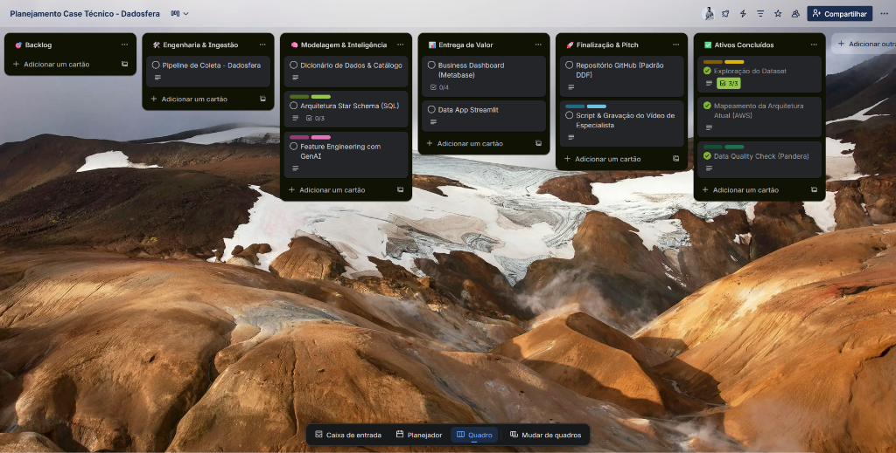
*Legenda: Board Kanban estruturado para o ciclo de vida do projeto de Analytics Engineering.*

## **1. Seleção do Dataset**

Escolha de uma base real de e-commerce com mais de 100k registros para garantir a escalabilidade da solução.

**link:** https://www.kaggle.com/datasets/olistbr/brazilian-ecommerce

*Legenda: Dataset Olist selecionado pela sua complexidade relacional e volume de dados (+100k pedidos).*

## **2. Integração (Módulo Integrar)**

Os dados foram ingeridos na plataforma Dadosfera utilizando o módulo Integrar, onde foram criados pipelines de upload para arquivos Parquet, garantindo a integridade dos tipos de dados e a documentação inicial dos metadados.

**Link:** https://app.dadosfera.ai/pt-BR/collect/import-files

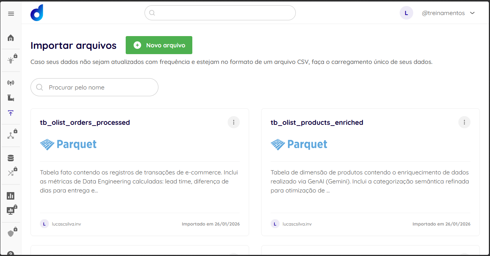
*Legenda: Registro do pipeline de ingestão no módulo Integrar. A imagem confirma o sucesso no upload dos arquivos em formato .parquet, garantindo a preservação dos schemas e a otimização do armazenamento no Data Lakehouse.*

## **3. Catalogação(Módulo Explorar)**

Após a integração, os dados foram registrados como ativos oficiais no módulo Explorar da Dadosfera. Esta etapa foi fundamental para garantir a transparência da linhagem dos dados e a documentação das regras de negócio aplicadas.

Durante a etapa de catalogação no módulo Explorar, identifiquei que a coluna original PRODUCT_CATEGORY_NAME apresentava 610 valores nulos (conforme evidenciado nos indicadores de qualidade da plataforma). Para garantir a integridade analítica, documentei a estrutura das tabelas conforme abaixo:

### **Tabela: tb_olist_products_enriched (Dimensão de Produtos)**

Esta tabela representa o maior ganho de governança do projeto, onde a Inteligência Artificial foi utilizada para tratar falhas de preenchimento da base original.

**Link:** https://app.dadosfera.ai/pt-BR/catalog/data-assets/6a5f51c8-7099-459f-83c8-f8a3746af8f6

    Destaque de Governança: A coluna original PRODUCT_CATEGORY_NAME apresentava 610 valores nulos.

    Solução: Foi criada a coluna GENAI_CATEGORY via LLM (Gemini 1.5 Flash). Esta coluna possui 0% de nulos, garantindo que 100% dos produtos agora possuem uma categoria semântica válida para análise no Dashboard.
    
| Coluna | Descrição | Nota de Governança |
| :--- | :--- | :--- |
| `PRODUCT_ID` | Chave primária do produto | Identificador único. |
| `PRODUCT_CATEGORY_NAME` |	Categoria original | Contém inconsistências e nulos. |
| `GENAI_CATEGORY` | Categoria via IA |	Feature criada via LLM para normalizar a base e tratar os 610 nulos. |

Nota: A documentação foi espelhada neste README para garantir a linhagem dos dados fora da camada de processamento.

*Legenda: Análise de integridade e completude de dados. O painel de Data Quality evidencia a eficácia da estratégia de IA: enquanto a categoria original apresenta lacunas (610 nulos), a coluna enriquecida via GenAI entrega 100% de preenchimento, eliminando o ruído analítico.*

### **Tabela: tb_olist_orders_processed (Tabela Fato)**

Centraliza as métricas de performance logística calculadas durante a fase de engenharia.

**Link:** https://app.dadosfera.ai/pt-BR/catalog/data-assets/c3fcdfa8-8129-4285-9d85-4fb8a4efd850

Colunas Enriquecidas:

    LEAD_TIME: Diferença em dias entre a compra e a entrega real.

    DELIVERY_PERFORMANCE: Diferença entre a data prevista e a entrega real (atraso/antecipação).

    SEASONALITY_FLAG: Classificação temporal dos pedidos (ex: Black Friday, Natal).

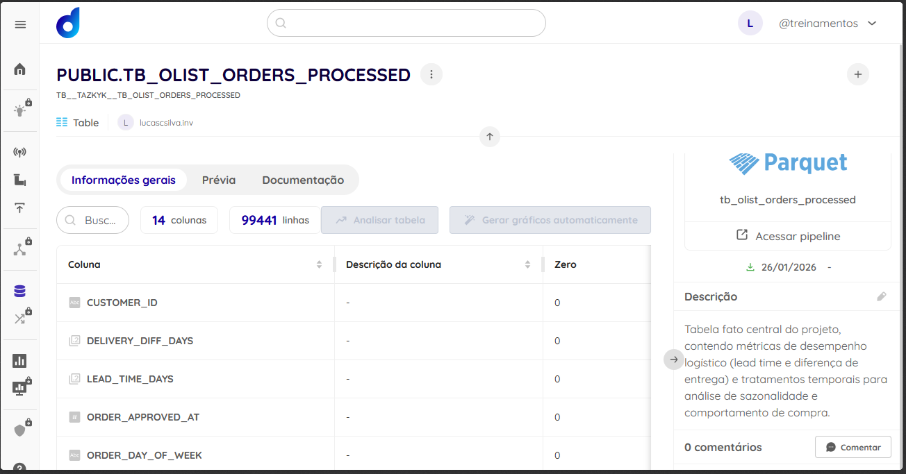

### **Tabela: tb_olist_customers (Dimensão de Clientes)**

**Link:** https://app.dadosfera.ai/pt-BR/catalog/data-assets/1e1df43f-48d5-4723-938c-8da87b82f7d0

    Uso: Fornece a granularidade geográfica necessária para o mapeamento de calor das vendas por estado e cidade.

    Status de Qualidade: 100% de completude nos campos de localização.

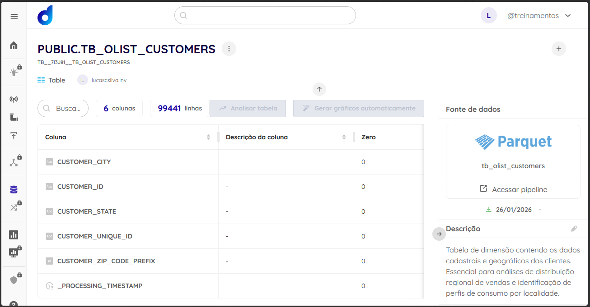

## **4. Processamento de Dados & Data Quality**

Aplicação de limpeza, tratamento de tipos e testes de qualidade via Python(Notebook anexo).

**Link:** https://colab.research.google.com/github/Luckaz7/LUCAS_CARVALHO_DDF_TECH_012026/blob/main/notebooks/processamento_dados.ipynb

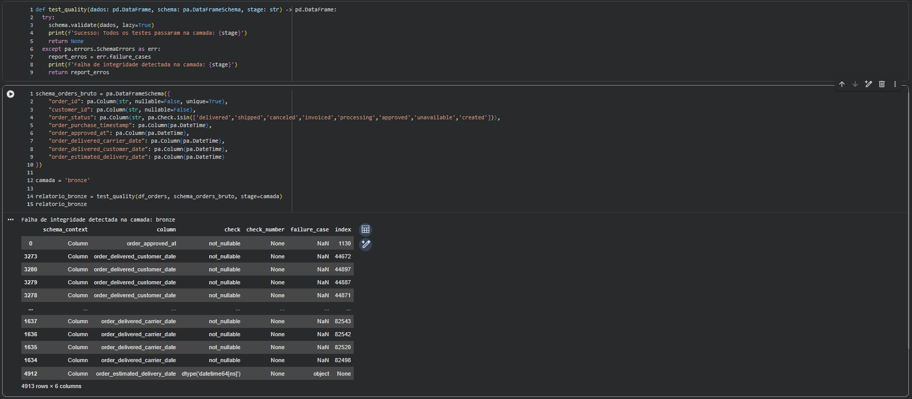

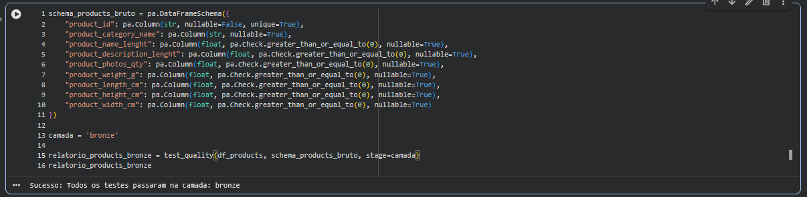
*Legenda: Auditoria de dados via Python(Pandera) identificando integridade de chaves primárias e tratamento de valores nulos.*

Verificação de Data Quality após correção:

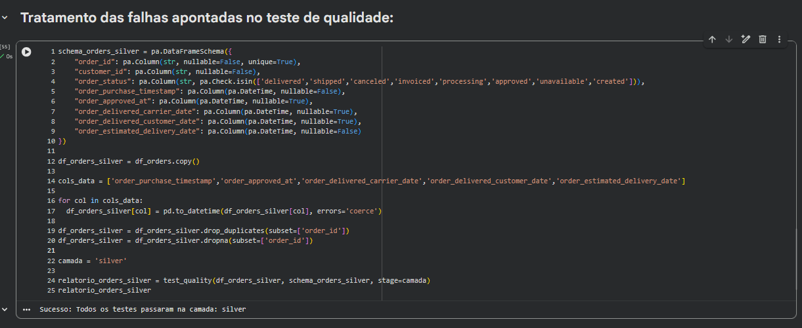
*Legenda: Nova auditoria de dados via Python(Pandera) corrigindo as falhas de integridade encontrada nos dados.*

## **5. Inteligência de Dados(GenAI)**

Enriquecimento da base original utilizando modelos de linguagem para categorização inteligente.

**Link:** https://colab.research.google.com/github/Luckaz7/LUCAS_CARVALHO_DDF_TECH_012026/blob/main/notebooks/processamento_dados.ipynb

**Nota de Implementação(GenAI via API do Gemini)**: Durante o enriquecimento, identifiquei respostas nulas da API devido aos filtros de segurança padrão(Safety Settings), onde implementei um tratamento de exceções no pipeline Python para garantir a continuidade da ingestão, mapeando retornos inválidos temporariamente como 'Não Mapeado' para manter a integridade do schema no carregamento para a Dadosfera.

*Legenda: Extração de atributos de produtos via LLM para maior granularidade na análise de vendas.*

## **6. Modelagem**

Para a estruturação dos dados, utilizei o Editor de Consultas Visual (No-Code) da plataforma, sendo fundamental para conectar a tabela fato de pedidos com as dimensões de clientes e produtos enriquecidos, criando uma camada semântica pronta para análise.

Ações Realizadas:

    Criação de junções (Left Joins) entre a tabela TB_OLIST_ORDERS_PROCESSED e TB_OLIST_CUSTOMERS utilizando a chave Customer ID.

    Estabelecimento de relações para permitir o cruzamento de métricas geográficas com o status operacional dos pedidos.

Performance: Devido à volumetria de dados (Big Data), as consultas foram otimizadas através de agregações diretas para garantir um tempo de resposta eficiente no Dashboard.

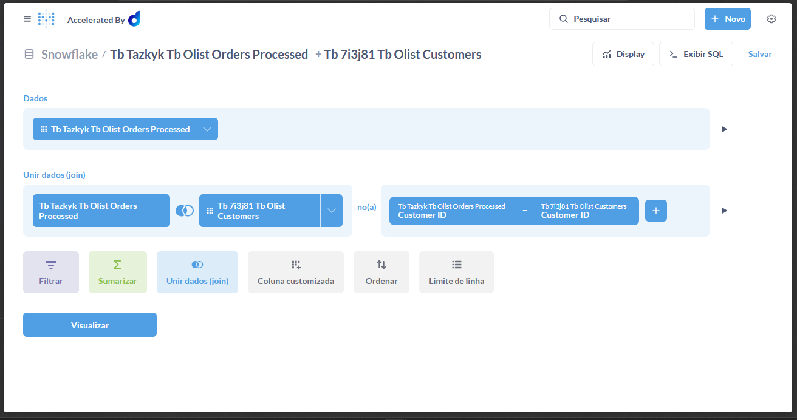 
*Legenda: Configuração visual do Join entre a tabela fato de pedidos e a dimensão de clientes.*

## **7. Visualização**

Nota: Para a visualização dos dados, utilizei o Metabase integrado. Devido à alta volumetria do dataset Olist, optei por criar visualizações segmentadas por ativos de dados para garantir a melhor performance de resposta e estabilidade do dashboard(SLA de visualização).

**Link:** https://metabase-treinamentos.dadosfera.ai/collection/1029-lucas-carvalho-case-tecnico-analytics-engineer

*Legenda: visualizações segmentadas por ativos de dados.*

O resultado final foi consolidado em um Dashboard Executivo com 5 visualizações dinâmicas, oferecendo uma visão 360º da operação.

### **7.1 Construção do Star Schema(Kimball)**

A modelagem foi estruturada seguindo a metodologia Star Schema de Ralph Kimball, onde defini a tabela de pedidos como a Fato, conectando-a às Dimensões de Clientes e Produtos, uma vez que essa arquitetura permite que as métricas de negócio(como volume de vendas e lead time) sejam filtradas por qualquer atributo das dimensões, como localização geográfica ou a nova categoria gerada por GenAI.

    Tabela Fato: TB_OLIST_ORDERS_PROCESSED como o centro da análise(o evento de negócio: o pedido);

    Tabelas Dimensão: Conecção da Tabela Fato às dimensões CUSTOMERS e PRODUCTS_ENRICHED(enriquecida por GenAI);

    Relacionamentos: Foi estabelecida as chaves(Customer ID e Product ID) para criar o relacionamento 1:N, sendo uma definição clássica de Star Schema.

### **7.2 KPIs e Visualizações Criadas:**

**Link Dashboard:** https://app.dadosfera.ai/pt-BR/catalog/data-assets/b13d7eac-521a-4a83-a6b2-9c9a094d28c2

    Distribuição de Categorias via IA(Gráfico de Rosca): Demonstra o sucesso do enriquecimento de dados com Gemini, categorizando 32.951 produtos.

    Distribuição de Status de Pedidos(Gráfico de Barras): Visão operacional da saúde das entregas, com destaque para 96.478 pedidos entregues.

    Tendência de Vendas Mensal(Gráfico de Linha): Identificação de picos de demanda ao longo do tempo.

    Top 10 Estados com mais Clientes(Gráfico de Barras): Inteligência geográfica revelando a dominância do estado de SP no volume de clientes.

    Lead Time Médio por Status(Gráfico de Rosca): Métrica de eficiência logística processada no pipeline de dados.

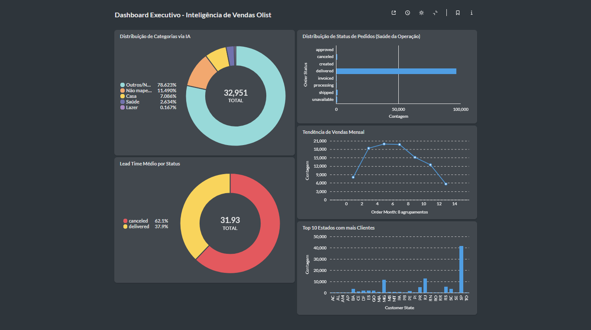 
*Legenda: Dashboard Final em Dark Mode apresentando os insights de negócio e engenharia de dados.*

### **8. Pipelines de Dados e Orquestração**

Devido a restrições de conectividade entre o ambiente Sandbox da Dadosfera e os provedores Cloud(Google/Render) via protocolos de rede, a etapa de Pipeline foi documentada através de sua Arquitetura Lógica, garantindo a entrega do projeto conforme os requisitos:

    Modelagem de Ingestão: Projetei o pipeline para conexão via PostgreSQL (Supabase), estruturando a extração dos dados transacionais da Olist.

    Pipeline de Transformação (ETL): O fluxo foi desenhado para realizar o saneamento em Python e o cálculo de métricas de logística (LEAD_TIME).

    Orquestração de IA: Integração de um step de micro-transformação para consumo do modelo Gemini, automatizando a categorização de produtos.

 
*Legenda: Acesso bloqueado para conexão com a fonte de dados no Google Cloud Storage*

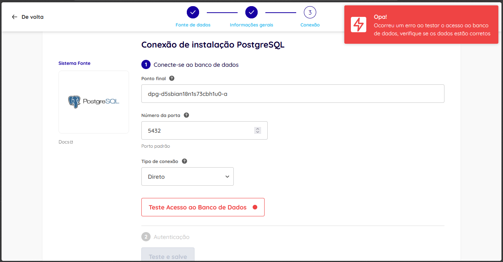 
*Legenda: Erro de conexão com DB PostgreSQL via Render*

### **9. Data App(Streamlit)**

Solução: Como o módulo nativo da plataforma não estava liberado para este usuário, desenvolvi um Data App externo utilizando Streamlit e WSL2.

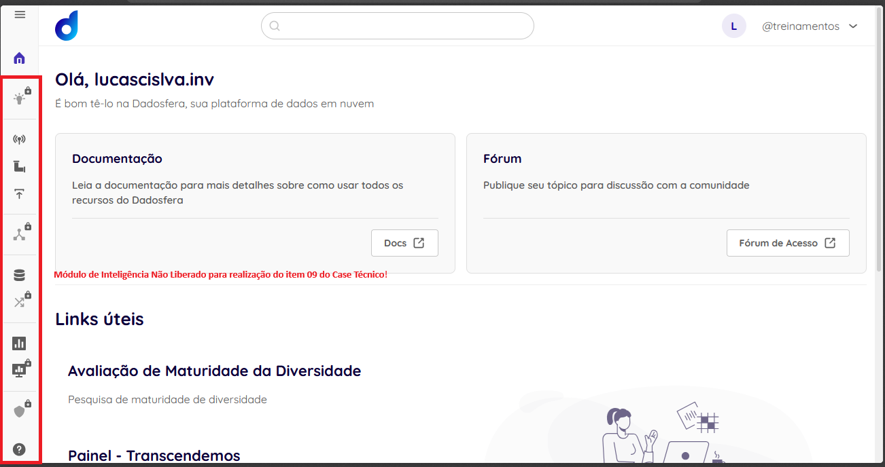 
*Legenda: Módulo inteligência inacessivel*

Funcionalidade: O app permite filtrar produtos por categorias geradas pela IA ("Saúde", etc.) e exibe insights automáticos sobre o volume de produtos reclassificados, provando o valor do enriquecimento de dados. 

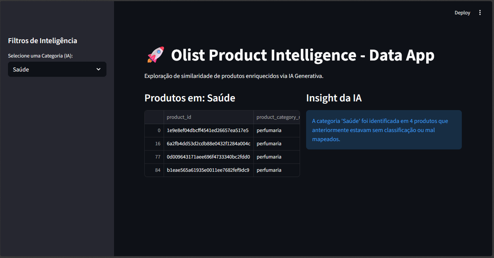 
*Legenda: Insights automáticos sobre o volume de produtos reclassificados*

### **10. Apresentação do Case**

    Status: Planejado.

    Link do vídeo com a proposta de valor e substituição da arquitetura legada pela Dadosfera (em breve).

    • [INSIRA O PRINT]
